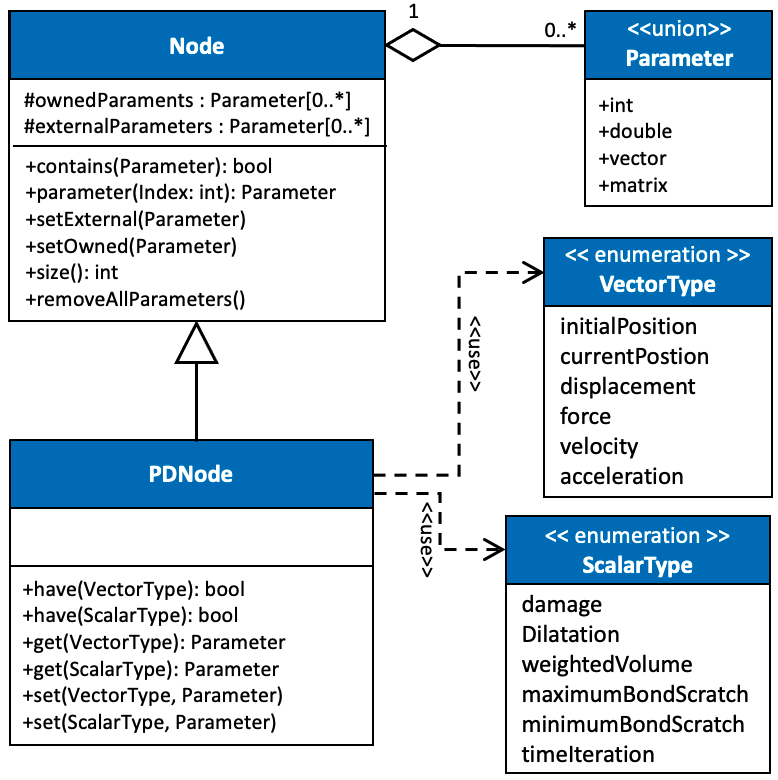
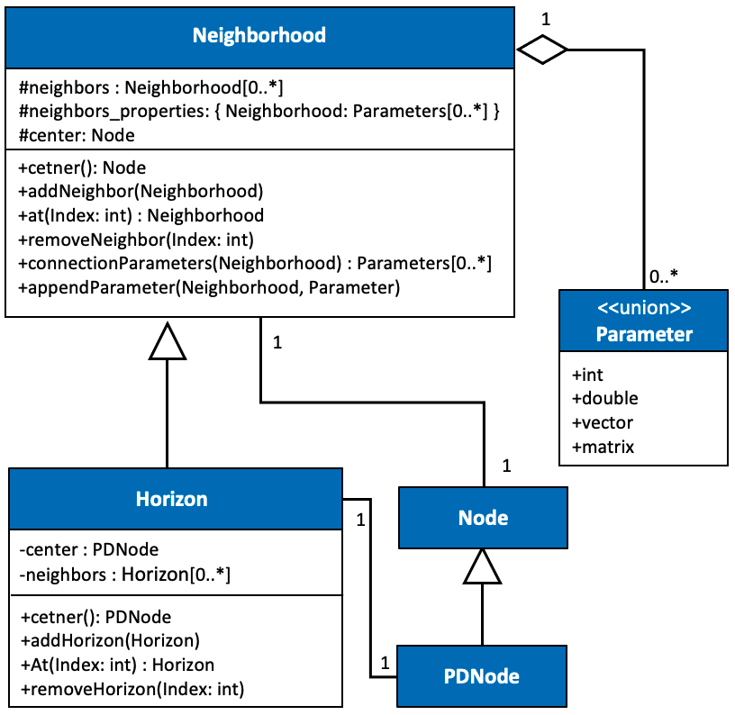
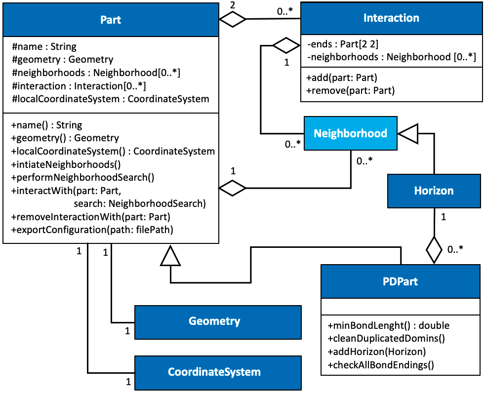

<a name="Top"/> 
##### Table of Contents  
* [Configuration](#Configuration)                
  + [Node](#Node)                                
  + [Co-location approach](#ColocationApproach)               
  + [Neighborhood](#Neighborhood)                
  + [Part](#Part)                                

<a name="Configuration"/> 
# Configuration

<a name="Node"/> 
## Node
The implementation of any node-based method approach requires the nodes to carry the relative subdomain information such as position, displacement, velocity, di- latation, etc. The co-location approach does not limit the storage of data at Node in any respect. RBA suggests using a global Node that may or may not own its parame- ter by itself. For instance, the nodes’ initial position is recommended to be owned by other quantities that can secure the covering the entirety of the co-location approach’s domain condition. Still, the force is recommended to be stored inside the Node to ensure the node forces stay independent. The recommended UML diagram of such implementation is as follows

   
   Figure 1: The configuration::Node UML diagram. The parameter stands for any data type to store node properties or information. 

The Node is a base class for all the nodes. Each numerical method (i.g., PD) that desires to have a specialized subclass of the Node has to implement its own definition of the Node (i.g., PDNode) inside the relation that is required to use the new node definition to follow the microkernel architecture. Thus the RBS includes the Node inside rbs::configuration namespace while the PDNode is defined inside rbs::relations::peridynamic namespace.

[back to top of the page.](#Top) 
<a name="ColocationApproach"/> 
## Co-location approach

The discretization of the space and time divides the PD problem’s physical system into a finite number of subdomains in which the co-location approach is employed. The co-location approach is relevant to the one point Gauss quadrature scheme where all the physical parameters are constant over the subdomain. The co-location approach requires the subdomains to cover the entirety of the domain, otherwise, the non-covered area of the domain will be handled as material cavitation by PD. Thus a random generation of the subdomains similar to most mesh-free methods cannot be accepted and requires extra attention to fulfill the co-location approach condition.
To sustain the co-location approach condition on peridynmaic simulations, use the background meshing and node management provided by the coordinate_system namespace.

[back to top of the page.](#Top)
<a name="Neighborhood"/> 
## Neighborhood

The RBS does not define any form of data structure to store the bonds. Instead, it stores the Nodes’ connection inside the Neighborhood and as a form of pointers to the neighbor Nodes’ Neighborhoods; this approach increases the code’s extendability since more information can be accessed through the Neighborhood connections than Node connections. Moreover, defining bonds as a connection between two Neighborhoods has several advantages,
  - If the constitutive model requires access to the Neighborhood of the bond ends (i.e., neighbors of its neighbors), it does not require performing any search.
  - The border (faces, edges, or corners) of the domain can be quickly found by selecting a random neighborhood and performing any tree or graph data structures search.
  - If the constitutive model applies any adoptive scheme (i.g., adoptive refinement around or in front of the crack tip), it can search among the neighbor’s Neighborhood instead of performing a global search on all the neighborhoods.
  - It forms a network of neighborhoods, which eases the search algorithms to be implemented within the RBS. For instance, one can implement an intersection neighborhood search by only accessing one of the Neighborhood and loop through its neighbors, its neighbor’s neighbors, and beyond.

The recommended UML diagram of Neighborhood is as follows

   
   Figure 2: The configuration::Neighborhood UML diagram. The Parameter, Node and, PDNode relations can be found in Figure 1 

[back to top of the page.](#Top) 
<a name="Part"/> 
## Part

A flexible computation method should allow simulations containing different constitutive models and possibly rigid bodies where they may need to be analyzed parallelly or while interacting with each other. Introducing the concept of ”Part,” where each Part contains a local coordinate system, a geometry, neighborhoods of a body or part of the problem domain, and neighborhoods containing neighbors from other Part reduces the complexity of implementing any constitutive models by hiding the neighborhood search algorithm following the Facade Design pattern. The material points inside the Part have the same material behavior, same neighborhood geometry (same horizon shape for PD problems), same neighborhood search function, and same discretization routine. Each Part can have a unique time integration scheme and a constitutive model. The parts may also overlap (i.g., simulating porous materials). Figure 3 illustrates the Part UML diagram that satisfies the points mentioned above.

   
   Figure 3: The configuration::Part UML diagram. TThe Neighborhood, and Horizon UML diagrams can be found in Figure 2. 

The RBS uses the Facade Design pattern to hide the complexity of the performing neighborhood. Each Part comes with only one local coordinate system, one neighborhood search algorithm, and one geometry. The parts then can be combined to create a bigger domain if required. Although the Part’s implementation can be ignored, it is highly recommended because not only it simplifies the interface for using the neighborhood search and local coordinate system, it also secures the neighborhoods from unexpected alteration and eases the exportation of the part. 

[back to top of the page.](#Top) 
Copyright (c) 2021-present, Ali Jenabidehkordi
