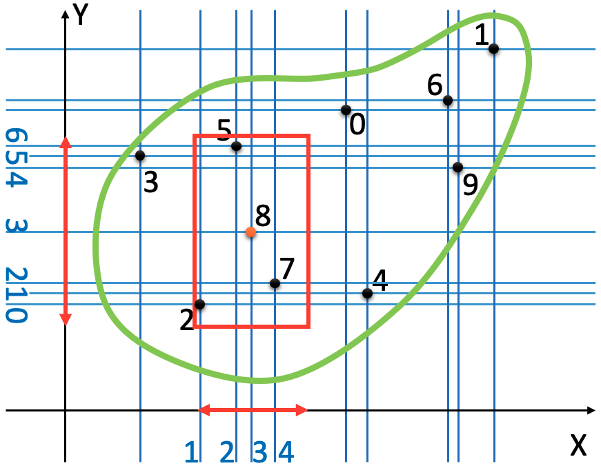
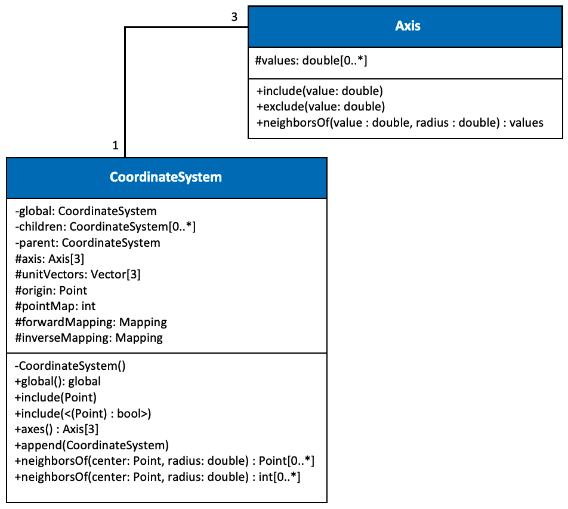

<a name="Top"/><br>
##### Table of Contents  
* [Coordinate System](#CoordinateSystem)                                                      <br>
* [NeighborhoodSearch](#NeighborhoodSearch)                                                   <br>
* [Examples](#Examples)

<a name="CoordinateSystem"/><br>
# Coordinate System

RBS coordinate system is a storage for the point positions; this can be used as the Nodes' initial position or as the current position of the nodes if the object is moving. The reason behind defining a new data type for storing the points' components is the flexibility in defining complex geometries (see Complex Geometry) and the significant reduction of neighborhood search costs. For instance, in a 3D neighborhood search with 1000000 uniform nodes, the problem's size will reduce to 3 × 100. However, a background grid is considered bad practice since it limits the nodes to follow the background pattern and does not allow random generation. An ideal dynamic background grid allows random generation while it does not increase the neighborhood search costs. The `coordinate_system::CoordinateSystem` imports the nodes to the background grid coordinate system and decomposes them to the grid lines (in 3D grid planes), which will be stored in `coordinate_system::Axis`. Then it defines a linear index to the points and maps them to the pointer of the points. The following image illustrates a random domain described with ten randomly generated nodes. 

<p align="center">
   
  <br>Figure 1: The schematic illustration of a 2D dynamic background grid with random discretization of the random domain, and the rectangular neighborhood of N8.<br>
</p>

The UML diagram of the CoordinateSystem is as follows

<p align="center">
   
  <br>Figure 2: The coordinate_system::CoordinateSystem UML diagram.<br>
</p>

which is a singleton with a tree structure that provides a Global coordinate system at the root of the tree while finite local coordinate systems (cartesian, spherical, and cylindrical) can be defining under it. Simultaneously, each local coordinate system can have an infinite local coordinate system of type cartesian, spherical, and cylindrical coordinate systems. The `coordinate_system::CoordinateSystem` is thread-free singleton, thus, the existence of only one coordinate system tree in the software is guaranteed, and the points of one coordinate system can then be transferred to any other coordinate system as follows:

```C++
using namespace rbs::coordinate_system;
const auto& localCartesianCoordinateSystem = CoordinateSystem::Global().appendLocal(CoordinateSystem::Cartesian, {1,0,0}, {0,1,0}, {0,0,1});
const auto& localCylindricalCoordinateSystem = CoordinateSystem::Global().appendLocal(CoordinateSystem::Cylindrical, {1,0,0}, {1, grid::toRad(90) ,0}, {0,0,1});
const auto pointInLocalCylindricalCoordinateSystem = localCylindricalCoordinateSystem.convert({2, 3, 4}, localCartesianCoordinateSystem);
```

The above code converts the point at `{2, 3, 4}` inside a cartesian local coordinate system to a cylindrical local coordinate system. Moreover, the utilities for meshing different coordinate systems (namely, cartesian, spherical, and cylindrical) is provided in rbs::coordinate_system::grid::generators.

[back to top of the page.](#Top)<br>
<a name="NeighborhoodSearch"/><br>
## Neighborhood Search

The following code needs to be done to search neighborhoods inside a body, given that the body has already empty `Neighborhood`s.
```C++
for(const auto& neighborhood : neighborhoods) {
    const auto centrePosition = neighborhood->centre()->initialPosition().value<space::Point<3> >();
    const auto neighborIndexes = p_localCoordinateSystem->getNeighborPointIndices(centrePosition, searchVector, function, centrePosition);

    if ( neighborIndexes.size() ) {
        auto& neighborhoodNeighbors = neighborhood->neighbors();
        std::transform(neighborIndexes.begin(), neighborIndexes.end(), std::back_inserter(neighborhoodNeighbors),
           [localMapper](const coordinate_system::CoordinateSystem::LinearIndex& neighborCentreLinearindex){
               return localMapper.at(neighborCentreLinearindex);
           });
    }
}
```
where `localMapper` maps the linear index of the points of the local coordinate system to the pointer of the `Neighborhood`s. Note that the Part already includes a member function to perform the search; thus, you do not require to perform the search manually.

[back to top of the page.](#Top)<br>
<a name="Examples"/><br>
## Examples
The [CoordinateSystemExamples.cpp](CoordinateSystemExamples.cpp) contains detailed examples of creating local coordinate systems within local coordinate systems within the global coordinates system, their meshing, editing the meshing, neighborhood search, and exporting them.   

In order to run the examples, you need to perform the following steps. 
  1. Download or folk the repository.
  2. Navigate to the folder of the code that you just downloaded.
  3. Navigate to the `documentation/coordintate_system` folder and copy the [CoordinateSystemExamples.cpp](CoordinateSystemExamples.cpp) and [CoordinateSystemExamples.pro](CoordinateSystemExamples.pro).
  4. Navigate to the `source` folder and paste the files.
  5. Create a root folder on your hard disk to save the result of the examples.
  6. Create the following structure under the folder you just created in the last step. <br>
     `root` folder
      - coordinates
        + vtks
      - editing
        + vtks
      - neighbors   
        + PairedNeighbors
        + vtks
  7. Navigate to the `source` folder and open the [CoordinateSystemExamples.pro](CoordinateSystemExamples.pro) with [QtCretor](https://www.qt.io/product/development-tools).
  8. Search for `path` variable and change its value to the root folder (absolute path) you created in the 6th step. 
  9. Make sure that the path variable ends with folder separator character (i.e., `\` or `/` based on your operating system).
  10. Build and run the code.
  11. You can open the created vtk files with [ParaView](https://www.paraview.org).

Note that since the number of nodes is high, it might take a while to run the examples.

[back to top of the page.](#Top)<br>
Copyright (c) 2021-present, Ali Jenabidehkordi
