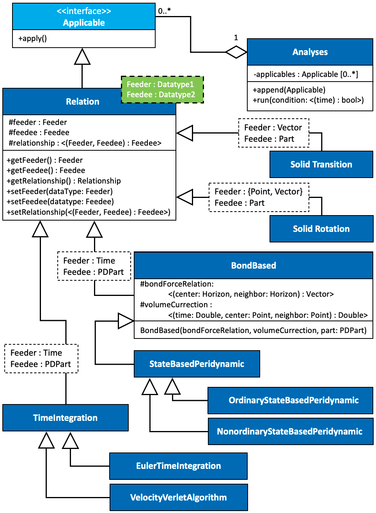

<a name="Relation"/> 
# Relation

The Relation allows changing data (Feedee) in the event of alternation of other or even the same data (Feeder). The event can be handed in two distinguished approaches, first by throwing a message from the Feeder whenever it receives change and receiving the message by the Relation to alter the Feedee, second looping through the existing Relations at each time step. As the first approach is preferable in terms of multiprocessing, but the order of the data structure alternation is not be guaranteed. Although it is possible to secure the process through switchers, I preferred the second approach because of its simplicity and guaranteed security on the order of Relations execution. The RBS uses a singleton called Analyse to register the Relations in the preferred order and execute them at each timestep. The Applicable interface is utilized, which is realized by the Relation to make the connection between Relations and Analyses possible.

The solid transition and solid rotation can simply be achieved by defining a Relation that its Feeder as the transition vector and rotation center and vector, respectively. The Feedee will be a Part whose local coordinate system will move or rotate at each execution. The constitutive models (i.g., Bond-Based Peridynamic) are Relation between Time (i.e., Feeder) to Part (i.e., Feedee) where at each time step the Part’s Nodes’ forces changes based on the Analyse Time. Note that the time integration is also a Relation between Time to Part with the difference that the Part’s Nodes’ parameters will be updated. It is also possible to include the time integrations within the constitutive models, but this approach is not recommended since it increases the maintenance cost.

   
   Figure 1: The relations::Relation UML diagram. 

Copyright (c) 2021-present, Ali Jenabidehkordi
