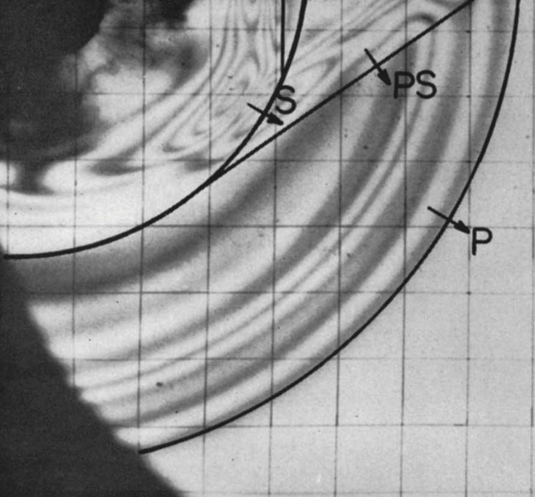
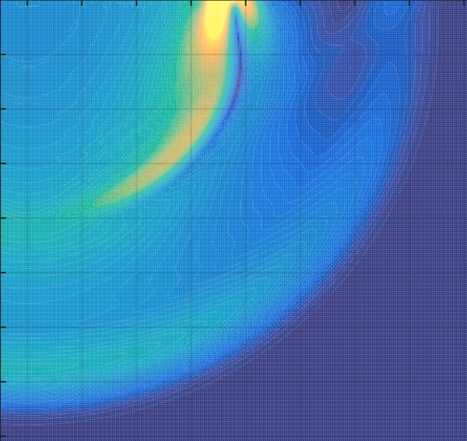
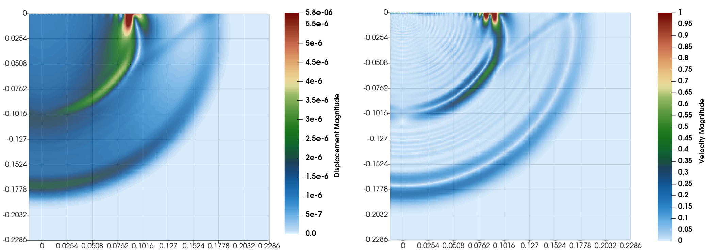
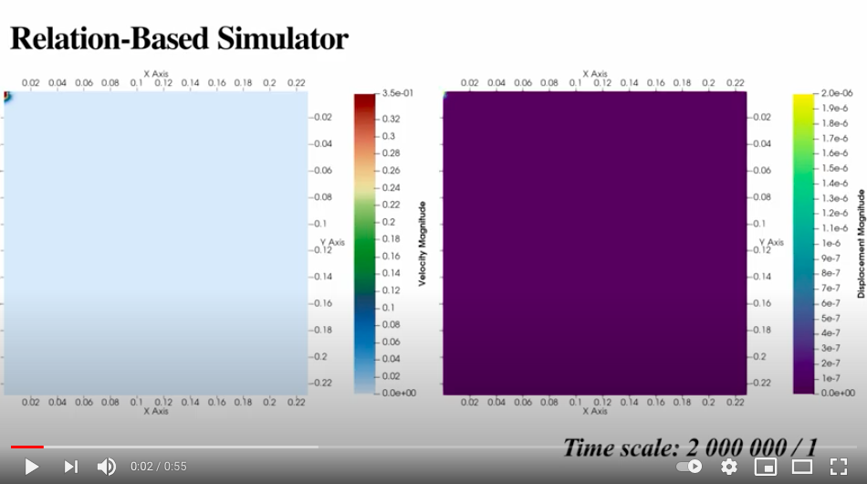

# Elastic Wave Propagation inside a Plate.

In this example, we simulate the experiment performed by Dally et al. reported in the paper "Observations of Stress Wave Propagation in a Half-plane with Boundary Loading". Their work is also simulated using Peridynamic by Nishawala et al., which is reported in depth in the paper "Simulation of Elastic Wave Propagation using Cellular Automata and Peridynamics, and Comparison with Experiments".
* You can find the ready to run `.cpp` file of this example [here](WaveDispersionAndPropagation.cpp).

This example's objection is to drive the same result as those found in experiments and simulations by Dally et al. and Nishawala et al. respectively. Following reported figures are recorded at 1.07E-04 seconds after the start of the experiment (i.e., the beginning of the simulation). The first figure on the left side is the distribution of the stresses, and the second one is the distribution of the displacement at 107 μsec. 


| Photoelastic Result                             | Displacement (Simulation Resutl)     | 
| ----------------------------------------------- |:------------------------------------:|
|  |  |


## Problem description.
We will use the same parameters as described in Nishawala et al.'s work to compare their results with ours. The Dally et al. study used an explosive charge, which is then simulated as an impulse at the middle midpoint of the plate's top edge by Nishawala et al. The applied sharp impulse has a pulse width of 20 μsec and a maximum amplitude of 20.7E3 N at ten μsec. The timesteps choose to be 0.125 μsec.

### Geometry
The plate is 1.0 m wide, 0.5 m high, with a thickness of 6.655 mm. Dally et al. assumed a 2D plate with a grid spacing of 0.977 mm, which results in 1024 nodes in the x-direction, 512 nodes in the y-direction, and one node in the thickness of the plate (z-direction).

### Material
The used material is CR-39, with an elastic modulus of 3.85GPa, a Poisson ratio of 1/3, and a mass density of 1300 kg/m^3. 

## Implementation.
* Define a folder path for exporting files of the program. The path can be relative or absolute but make sure it exists; otherwise, the logger will throw an exception, which stops the simulation.
    ```C++
    const std::string path = "/any-file-path/";
    ```

* Setup the logger as you wish; I put some of the possible logging options here. Note that I decided to use a separate folder (`logs`) for all of my logging files.
    ```C++
    auto& logger = report::Logger::centre();
    logger.setFileLevel(logger.Debug,   path + "logs/", "Debug");
    logger.setFileLevel(logger.Timing,  path + "logs/", "Timing");
    logger.setFileLevel(logger.Process, path + "logs/", "Process");
    logger.setFileLevel(logger.Warning, path + "logs/", "Warning");
    ```
    
    Later includes will include the logger, but if you want, you can include the logger as follow at the top of the file (outside of the main function).
    ```C++
    #include "report/Logger.h";
    ```
    
* Define the problem variables from the problem description section above.
    ```C++
    const double dencity = 1300;           // kg / m^3
    const double youngsModulus = 3.85e9;   // GPa
    const double poissonRasio = 1. / 3.;

    const auto plateHeight = 0.5;          // 0.5 m
    const auto plateWidth  = 1.0;          // 1.0 m
    const auto plateThickness = 0.006655;  // 6.655 mm

    const auto horizonRasio = 3.;
    const auto gridSpacing = std::min({plateWidth / 1024, plateHeight / 512});
    const auto horizonRadius = horizonRasio * gridSpacing;
    ```
    
* Define the plate's Part.
    1. At the top of the file (outside of the main function), include the Part and then add the following code, so we can avoid typing `rbs`, `std`, and `rbs::configuration` repetitively.
    ```C++
    #include "configuration/Part.h"
    
    using namespace rbs;
    using namespace rbs::configuration;
    using namespace std;
    ```
    
    2. Define the Part and giving it a name.
    ```C++
    using CS = coordinate_system::CoordinateSystem;
    auto platePart = Part("Plate", CS::Global().appendLocal(CS::Cartesian));
    ```
    
* Next, we need to define the Part's geometry and assign it.
    ```C++
    {
        const auto plateShape = geometry::Combined::Cuboid({-plateWidth / 2, -plateHeight, -plateThickness / 2},
                                                          space::vec3{plateWidth, 0, 0},
                                                          space::vec3{0, plateHeight, 0},
                                                          space::vec3{0, 0, plateThickness});               
        platePart.setGeometry(plateShape);
    }
    ```
    
    Check out [`the geometry module readme`](https://github.com/alijenabi/Relation-Based_Simulator/source/geometry/README.md) for more information on the available shapes and their combination.
    
* Meshing the Part's coordinate system.
    1. At the top of the file (outside of the main function), include the coordinate_system::grid.
    ```C++
    #include "coordinate_system/grid.h"
    ```
    
    2. Using the provided grid meshing functions, we can mesh the coordinate system as follows. For creating one mesh in Z-direction, we can override the mesh or change the distanceVector third component. Here, I prefer to override the Z-direction to avoid having problem with double precision.
    ```C++
    {
        const auto distanceVector = gridSpacing * space::consts::one3D;
        const auto startPoint = space::Point<3>{-plateWidth / 2, -plateHeight, -plateThickness / 2} + distanceVector / 2;
        const auto endPoint   = space::Point<3>{plateWidth / 2, 0, plateThickness / 2} - distanceVector / 2;

        coordinate_system::grid::cartesian::uniformDirectional(startPoint, endPoint,distanceVector, platePart.local().axes());
        platePart.local().axes()[2] = std::set<double>{0};
    }
    ```
    At the last line, we set the local coordinate system to ensure that only zero exists on the z-axis. This will not affect the simulation, but there is a chance that a non-zero (but very close to zero - due to double precision) exists on the z-axis instead, which will affect the exporting files in VTK format.
    Check out [`the coordinate system module readme`](https://github.com/alijenabi/Relation-Based_Simulator/source/coordinate_system/README.md) for more information.

* So far, we have defined the grid points by meshing the local coordinate system of the plate Part. We will now select those grid points inside the Part's geometry, and we mark them as the configuration collocation points.
    ```C++
    {
        const auto& plateShape = platePart.geometry();
        platePart.local().include([&plateShape](const auto& localPoint) {
            return plateShape.pointStatus(localPoint) == geometry::Inside;
        });
    }
    ```
    We can also accept all the gridpoints since we already know that all of the grid points will be inside the plate shape.
    ```C++
    platePart.local().include([](const auto&) { return true; });
    ```
    
* Neighborhood search. 
    1. First, we need to create neighborhoods and add them to the part. This can be done automatically from the marked points on the local coordinates system of the part.
    ```C++
    platePart.initiateNeighborhoods();
    ```
    
    2. Second, Add the volume and the density to all the added neighborhood's centre nodes. 
    ```C++    
    const double gridVolume = pow(gridSpacing, 2) * plateThickness;
    const auto& neighborhoods = platePart.neighborhoods();
    std::for_each(neighborhoods.begin(), neighborhoods.end(), [gridVolume, dencity](const Part::NeighborhoodPtr& neighborhood) {
        using Property = relations::peridynamic::Property;
        auto& centre = *neighborhood->centre();
        centre.at(Property::Volume).setValue(gridVolume);
        centre.at(Property::Density).setValue(dencity);
    });
    ```
    3. Third, for each Part's neighborhood, we search for its neighbors.
    ```C++
    platePart.searchInnerNeighbors(horizonRadius);
    ```
    
* Optionally, we can export the created configuration and some of the checkpoint neighborhoods to see if everything is as we expected it to be. I decided to use a separate folder (`vtks`) to export all of the configurations.
    ```C++
    platePart.exportConfiguration(path + "vtks/");    
    platePart.exportCheckpointNeighborhoods(path + "vtks/");
    ```

* Relations are the most exciting part of the simulation and where the magic happens. Let's see what kind of relationship we need and in which order we should add them to the Analyses! 

    Obviously, at each time step, we need to apply the load at the midpoint of the top edge, which is located at the origin of the plate Part local coordinate system, then we need to find the response of the plate using bond-based peridynamic similar to Nishawala's paper. Having the peridynamic forces at each Node, we can apply time integration to determine the nodal displacements, which will be needed for the next time step's peridynamic force computation. At the end of some of the time steps, we would like to export the computation result so we can examine them and stop the simulation if necessary.
    1. First, we need to include the peridynamic relations. You can achieve that by including the individual classes as you need them. For instance, for defining boundary domains:
    ```C++
    #include "relations/peridynamic/BoundaryDomain.h"
    ```
    
    or include all of the peridynamic relations 
    ```C++
    #include "relations/peridynamic.h"
    ```
    
    2. To define a peridynamic::BoundaryDomain we need a function that receives the simulation time and the node and modifies the node's properties accordingly. One can define a function above the main function or define a Lambda inside it. Using Lambdas allows us to capture already defined values (e.g., grid volume) instead of computing it every time or using a fixed value.
    ```C++
    const auto maxForcePerNode = 20.7e3 / ( plateThickness * gridSpacing * (1. / 4.) );
    const auto boundaryConditioner = [gridSpacing, maxForcePerNode](const double time, configuration::Node& node) {
        using Property = relations::peridynamic::Property;
        auto& postion = node.initialPosition().value<space::Point<3> >().positionVector();

        if (-gridSpacing <= postion[0] && postion[0] <= gridSpacing && -gridSpacing * 2.1 < postion[1]) {
            if (time <= 10e-6) {
                const auto load = - space::vec3{0, time * maxForcePerNode / 10e-6, 0};
                node.at(Property::Force) = load;
            } else if(time <= 20e-6) {
                const auto load = - space::vec3{0, maxForcePerNode - (time - 10e-6) * maxForcePerNode / 10e-6, 0};
                node.at(Property::Force) = load;
            } else {
                node.at(Property::Force) = space::consts::o3D;
            }
        } else {
            node.at(Property::Force) = space::consts::o3D;
        }
    };
    auto load = relations::peridynamic::BoundaryDomain(boundaryConditioner, platePart);
    ```
    To reduce the memory cost, we can change the else clause as follows; 
    
    ```C++
        if (-gridSpacing <= postion[0] && postion[0] <= gridSpacing && -gridSpacing * 2.1 < postion[1]) {
            ... same as above ...
        } else {
            if (node.has(Property::Force))
                node.at(Property::Force) = space::consts::o3D;
        }
    ```
    this will also reduce the computation costs since the BondBased and VelocityVerletAlgorithm will avoid computing if no parameter is stored on the Node. 
    
    3. Defining a VelocityVerletAlgorithm on the plate Part is fast forward.
    ```C++
    auto timeIntegration = relations::peridynamic::time_integration::VelocityVerletAlgorithm(platePart);
    ```
    
    4. Since we don't have any fracture, and the meshing is uniformed and cubic, we can use the Elastic bond-based peridynamic relation.
    ```C++
    const double bulkModulus = youngsModulus / ( 3 * (1 - 2 * poissonRasio));
    const double materialConstant = 12 * bulkModulus / (M_PI * gridSpacing * pow(horizonRadius, 3));
    auto platePDRelation = relations::peridynamic::BondBased::Elastic(materialConstant, gridSpacing, horizonRadius, platePart);
    ```
    
    5. For the exportation, we only need the 857th time step (i.e., simulation time 107 microseconds). Here though, I decided to export the configuration on current node positions every ten time-steps
    ```C++
    using P = relations::peridynamic::Property;
    using On = relations::peridynamic::Exporter::Target;
    const std::set properties = {P::Displacement, P::Velocity, P::Acceleration, P::Force};

    auto plateExporterCC = relations::peridynamic::Exporter(properties, On::CurrentConfiguration, platePart, path + "vtks/", "PlatePartOnCurrentConfig");
    plateExporterCC.setCondition([](const double, const size_t timeStep) {
        return timeStep % 10 == 0;
    });
    ```
    and export the closest time step to simulation time of 1.07e-4 (857th time step) both on the current and the initial node positions.
    ```C++    
    const auto exportationCondition = [maxTimeSpan](const double, const size_t timeStep) {
        return timeStep == 857;
    };
    auto plateExporterAt107ms = relations::peridynamic::Exporter(properties, On::InitialConfiguration, platePart, path + "vtks/", "plateExporterAt107ms");
    auto plateExporterAt107msCurrent = relations::peridynamic::Exporter(properties, On::InitialConfiguration, platePart, path + "vtks/", "plateExporterAt107msCurrent");
    plateExporterAt107ms.setCondition(exportationCondition);
    plateExporterAt107msCurrent.setCondition(exportationCondition);
    ```
    
* The last step is to set up the analysis and run the simulation.
    ```C++
    auto& analysis = Analyse::current();
    analysis.setTimeSpan(0.125e-6);
    analysis.setMaxTime(208e-6);
    analysis.appendRelation(load);
    analysis.appendRelation(platePDRelation);
    analysis.appendRelation(timeIntegration);
    analysis.appendRelation(plateExporterCC);
    analysis.appendRelation(plateExporterAt107ms);
    analysis.appendRelation(plateExporterAt107msCurrent);

    return analysis.run();
    ```
    Note that the order of applying the relations is the same as appending them. The load will override all of the non-zero forces, and then the relations::peridynamic::BondBased::Elastic will append all of the targeted Part's nodal forces.  Next, the time-integration will compute the nodal accelerations, velocities, and displacements, which will be exported at the end of each time step by exporter relations.

## Simulation Results
The following image and video are produced by importing the exported VTK files to Paraview. Please note that, our output is in meters while the images above this document are in inches.

<p align="center">
   
  <br>Displacement and velocity at 107 μsec.<br>
</p>

  [](https://youtu.be/A1s7-ZwBFA8)
  
Copyright (c) 2020-present, Ali Jenabidehkordi    
