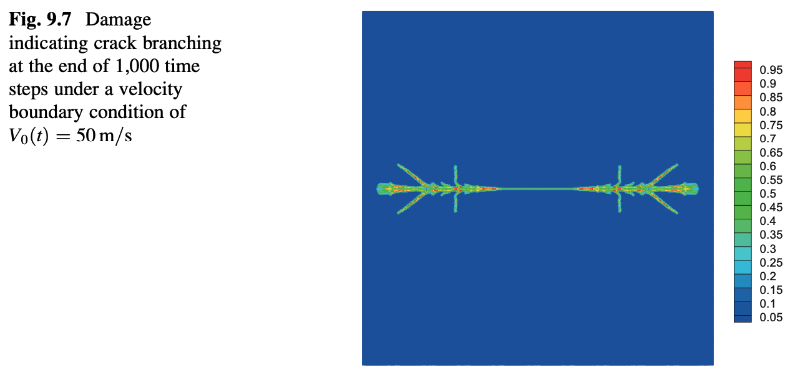
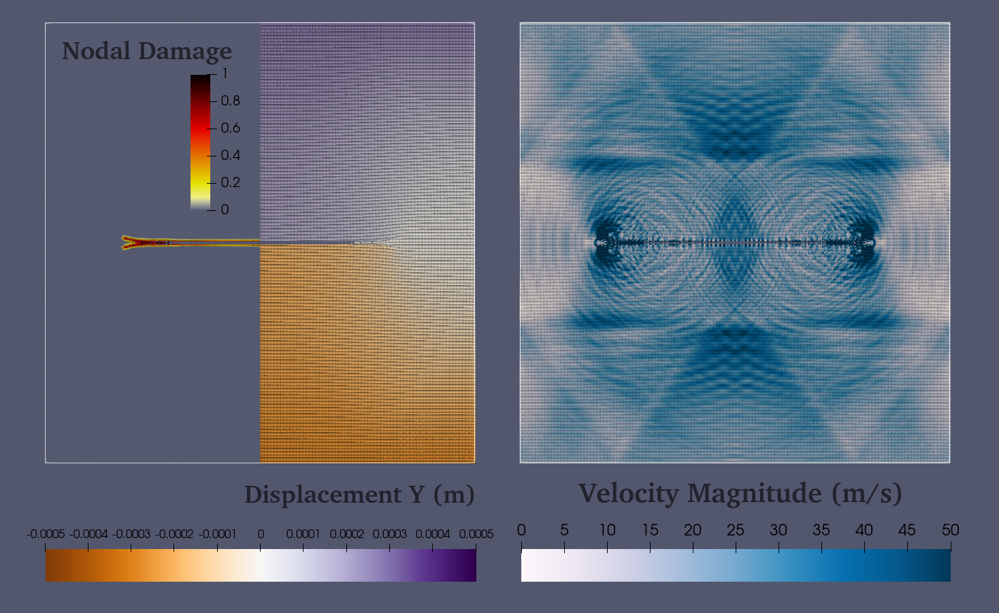
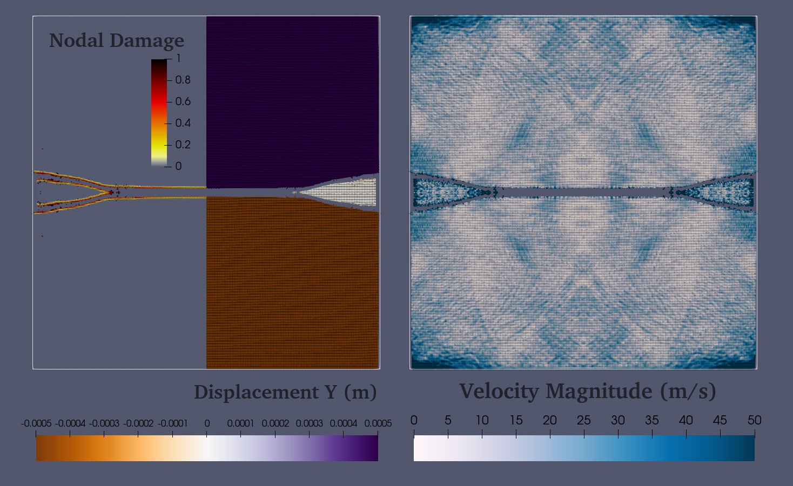
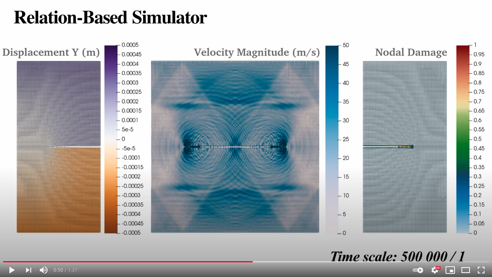
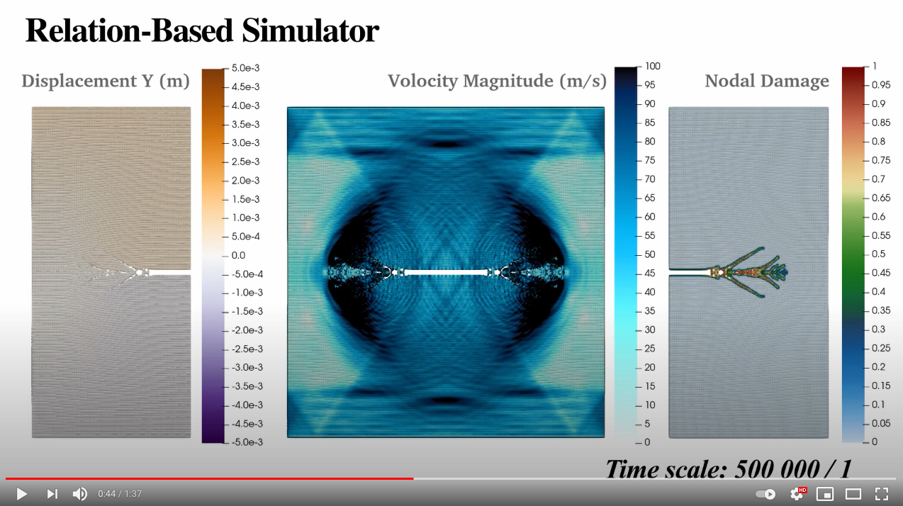

# Plate with a Pre-existing Crack Under Velocity Boundary Conditions

Presents the implementation of the example done in chapter 9.2: "Plate with a Pre-existing Crack Under Velocity Boundary Conditions" of the book ["Peridynamic Theory and Its Applications"](https://link.springer.com/book/10.1007/978-1-4614-8465-3) by Erdogan Madenci and Erkan Oterkus.

You can find the ready to run `.cpp` file of this example [here](PlateWithPreExistingCrack.cpp).

The Peridynamic Theory and Its Applications come with a series of codes written in Fortran90. Here, we will compare those codes' outcome (i.e., plate_with_a_preexisting_crack_v20.f90 and plate_with_a_preexisting_crack_v50.f90) to the RBS result.
The followings are the images that are reported in section 9.2 of the book.

<p align="center">
   
  <br>Same as the result of the plate_with_a_preexisting_crack_v20.f90.<br>
</p>
<p align="center">
   
  <br>Same as the result of the plate_with_a_preexisting_crack_v50.f90.<br>
</p>


## Problem description.
A plate with a pre-existing crack at the middle is subjected to a tension at two ends perpendicular to the crack length. The plate's response is then observed under tension created by pulling the plate with a constant of 20 or 50 meters per second. 

### Geometry
The plate is 5 cm wide, 5 cm high, with a thickness of 1 mm. The 2D plate is discretized with 500 grids in each direction and an extra three grid in the y-direction for applying boundary conditions. Thus the model has a total of 253000 nodes.

### Material
The material is assumed to have an elastic modulus of 192GPa, a Poisson ratio of 1/3, and a mass density of 8000 kg/m^3. 

## Implementation.
* Define a folder path for exporting files of the program. The path can be relative or absolute but make sure it exists; otherwise, the logger will throw an exception, which stops the simulation.
    ```C++
    const std::string path = "/any-file-path/";
    ```

* Setup the logger as you wish; I put some of the possible logging options here. Note that I decided to use a separate folder (`logs`) for all of my logging files.
    ```C++
    auto& logger = report::Logger::centre();
    logger.setFileLevel(logger.Debug,   path + "logs/", "Debug");
    logger.setFileLevel(logger.Timing,  path + "logs/", "Timing");
    logger.setFileLevel(logger.Process, path + "logs/", "Process");
    logger.setFileLevel(logger.Warning, path + "logs/", "Warning");
    ```
    
    Later includes will include the logger, but if you want, you can include the logger as follow at the top of the file (outside of the main function).
    ```C++
    #include "report/Logger.h";
    ```
    
* Define the problem variables from the problem description section above.
    ```C++    
    const double dencity = 8000;           // kg / m^3
    const double youngsModulus = 192e9;    // 192GPa
    const double poissonRasio = 1. / 3.;

    const auto boundaryVelocityMagnitude = 20.; // 20m/s or 50m/s

    const auto plateDimension = 0.05;      // 5 cm
    const auto plateThickness = 0.0001;    // 0.1 mm
    const auto preCrackLength = 0.01;      // 1 cm

    const auto horizonRasio = 3.015;       // m = 3.015
    const auto minMeshsInDimension = 500;
    const auto minMeshsInThickness = 1;
    const auto gridSpacing = std::min({plateDimension / minMeshsInDimension, plateThickness / minMeshsInThickness});
    const auto horizonRadius = horizonRasio * gridSpacing;

    const auto gridVolume = pow(gridSpacing, 2) * plateThickness;
    const auto boundaryVolume = 3. * plateThickness * plateDimension;

    const auto criticalStretch = 0.04472; // Use 1 to see the elastic response.

    const auto expectedTimeSpan = 1.3367e-8; // Mentioned in the book but not used in their code.
    const auto maxTimeSteps = 1250;
    const auto maxSimulationTime = maxTimeSteps * expectedTimeSpan;
    ```
    
* Define the plate's Part.
    1. At the top of the file (outside of the main function), include the Part and then add the following code, so we can avoid typing `rbs`, `std`, and `rbs::configuration` repetitively.
    ```C++
    #include "configuration/Part.h"
    
    using namespace rbs;
    using namespace rbs::configuration;
    using namespace std;
    ```
    
    2. Define the Part and giving it a name.
    ```C++
    using CS = coordinate_system::CoordinateSystem;
    auto platePart = Part("Plate", CS::Global().appendLocal(CS::Cartesian));
    ```
    
* Meshing the Part's coordinate system.
    1. At the top of the file (outside of the main function), include the coordinate_system::grid.
    ```C++
    #include "coordinate_system/grid.h"
    ```
    
    2. Using the provided grid meshing functions, we can mesh the coordinate system as follows. For creating one mesh in Z-direction, we can override the mesh or change the distanceVector third component. Here, we have to override the Z-direction; otherwise, there would be no value on the Z-axis, which leads to zero mesh.
    ```C++
    {
        const auto distanceVector = gridSpacing * space::consts::one3D;
        const auto radiusVector = space::vec3{plateDimension / 2, plateDimension / 2 + 3. * gridSpacing, plateThickness / 2};

        coordinate_system::grid::cartesian::uniformAroundOrigin(distanceVector, radiusVector, platePart.local().axes());
        platePart.local().axes()[2] = std::set<double>{ 0 };
    }
    ```
    Check out [`the coordinate system module readme`](https://github.com/alijenabi/Relation-Based_Simulator/source/coordinate_system/README.md) for more information.

* So far, we have defined the grid points by meshing the plate Part's local coordinate system. We will now select those grid points inside the Part's geometry (i.e., all of them), and we mark them as the configuration collocation points.
    ```C++
    platePart.local().include([](const auto&) { return true; });
    ```
    
* Neighborhood search. 
    1. First, we need to create neighborhoods and add them to the part. This can be done automatically from the marked points on the local coordinates system of the part.
    ```C++
    platePart.initiateNeighborhoods();
    ```
    
    2. Second, Add the volume and the density to all the added neighborhood's centre nodes. 
    ```C++    
    const double gridVolume = pow(gridSpacing, 2) * plateThickness;
    const auto& neighborhoods = platePart.neighborhoods();
    std::for_each(neighborhoods.begin(), neighborhoods.end(), [gridVolume, dencity](const Part::NeighborhoodPtr& neighborhood) {
        using Property = relations::peridynamic::Property;
        auto& centre = *neighborhood->centre();
        centre.at(Property::Volume).setValue(gridVolume);
        centre.at(Property::Density).setValue(dencity);
    });
    ```
    3. Third, for each Part's neighborhood, we search for its neighbors.
    ```C++
    platePart.searchInnerNeighbors(horizonRadius);
    ```

* The constructed plate has no crack as we connected all of the neighborhoods using `searchInnerNeighbors(horizonRadius)`. We can remove all of the bonds that one end is in the plate's upper half while the other end is located in the lower half. 
    ```C++
    {
        const auto halfSpace = geometry::Primary::HalfSpace(space::Point<3>{0, 0, 0}, space::consts::j3D);
        const auto& neighborhoods = platePart.neighborhoods();
        std::for_each(neighborhoods.begin(), neighborhoods.end(), [&halfSpace, preCrackLength, horizonRadius](const Part::NeighborhoodPtr& neighborhood) {
            const auto& centerPos = neighborhood->centre()->initialPosition().value<space::Point<3> >();
            const auto& centerPosVec = centerPos.positionVector();
            if (-preCrackLength / 2 < centerPosVec[0] && centerPosVec[0] < preCrackLength / 2
                && -horizonRadius * 2 < centerPosVec[1] && centerPosVec[1] < horizonRadius * 2) {
                const auto centerStatus = halfSpace.pointStatus(centerPos);
                auto& neighbors = neighborhood->neighbors();
                
                neighbors.erase(
                    std::remove_if(neighbors.begin(), neighbors.end(), [&halfSpace, centerStatus](const Part::NeighborhoodPtr& neighbor) -> bool{
                        const auto neighborStatus = halfSpace.pointStatus(neighbor->centre()->initialPosition().value<space::Point<3> >());
                        return neighborStatus != centerStatus || (neighborStatus == centerStatus && neighborStatus == geometry::On);
                    }),
                    neighbors.end());
            }
        });
    }
    ```
    
    Alternatively, we can mark the bonds as fully damaged instead of removing them; this approach will be slightly slower than the one above, yet, the pre-existing crack will be visible if we export the node damages.
    
    ```C++
    {
        const auto halfSpace = geometry::Primary::HalfSpace(space::Point<3>{0, 0, 0}, space::consts::j3D);
        const auto& neighborhoods = platePart.neighborhoods();
        std::for_each(neighborhoods.begin(), neighborhoods.end(), [&halfSpace, preCrackLength, horizonRadius](const Part::NeighborhoodPtr& neighborhood) {
            const auto& centerPos = neighborhood->centre()->initialPosition().value<space::Point<3> >();
            const auto& centerPosVec = centerPos.positionVector();
            if (-preCrackLength / 2 < centerPosVec[0] && centerPosVec[0] < preCrackLength / 2
                && -horizonRadius * 2 < centerPosVec[1] && centerPosVec[1] < horizonRadius * 2) {
                const auto centerStatus = halfSpace.pointStatus(centerPos);
                auto& neighbors = neighborhood->neighbors();
                
                std::for_each(neighbors.begin(), neighbors.end(), [&halfSpace, &neighborhood, centerStatus](const Part::NeighborhoodPtr& neighbor) {
                    using Property = relations::peridynamic::Property;
                    const auto neighborStatus = halfSpace.pointStatus(neighbor->centre()->initialPosition().value<space::Point<3> >());
                    const bool shouldMark = neighborStatus != centerStatus || (neighborStatus == centerStatus && neighborStatus == geometry::On);
                    if (shouldMark) {                        
                        neighborhood->setStatus(neighbor, Property::Damage, int(1));
                    }
                });
            }
        });
    }
    ```
    
* Optionally, we can export the created configuration and some of the checkpoint neighborhoods to see if everything is as we expected it to be. I decided to use a separate folder (`vtks`) to export all of the configurations.
    ```C++
    platePart.exportConfiguration(path + "vtks/");    
    platePart.exportCheckpointNeighborhoods(path + "vtks/");
    ```

* Relations are the most exciting part of the simulation and where the magic happens. Let's see what kind of relationship we need and in which order we should add them to the Analyses! 

    At each time step, we need to apply the load at both ends of the plate, and then we will compute the plate's response using bond-based peridynamic, allowing the brittle fracture. Having the peridynamic forces at each Node, we can apply Euler time integration to determine the nodal displacements, which will be needed for the next time step's peridynamic force computation. At the end of some of the time steps, we would like to export the computation result so we can examine them and stop the simulation if necessary.
    
    1. First, we need to include the peridynamic relations. You can achieve that by including the individual classes as you need them. For instance, for defining boundary domains:
    ```C++
    #include "relations/peridynamic/BoundaryDomain.h"
    ```
    
    or include all of the peridynamic relations 
    ```C++
    #include "relations/peridynamic.h"
    ```
    
    2. To define a peridynamic::BoundaryDomain we need a function that receives the simulation time and the node and modifies the node's properties accordingly. One can define a function above the main function or define a Lambda inside it. Using Lambdas allows us to capture already defined values (e.g., grid volume) instead of computing it every time or using a fixed value.
    ```C++
    const auto boundaryConditioner = [boundaryVelocityMagnitude, plateDimension](const double time, configuration::Node& node) {
        using Property = relations::peridynamic::Property;
        auto& position = node.initialPosition().value<space::Point<3> >().positionVector();

        if (position[1] > plateDimension / 2 || position[1] < -plateDimension / 2) {
            const auto velocity = node.has(Property::Velocity) ? node.at(Property::Velocity).value<space::vec3>() : space::consts::o3D;
            const auto displacement = node.has(Property::Displacement) ? node.at(Property::Displacement).value<space::vec3>() : space::consts::o3D;

            const auto directionalVelocityMagnitude = (position[1] > 0 ? 1. : -1.) * boundaryVelocityMagnitude;
            const auto directionalDisplaceMagnitude = boundaryVelocityMagnitude * time;

            node.at(Property::Velocity)     = space::vec3{velocity[0], directionalVelocityMagnitude, velocity[2]};
            node.at(Property::Displacement) = space::vec3{displacement[0], directionalDisplaceMagnitude, displacement[2]};
        }
    };
    auto load = relations::peridynamic::BoundaryDomain(boundaryConditioner, platePart);
    ```
    
    3. Since we want to allow brittle fracture, and the meshing is uniformed and cubic, we can use the `BrittleFracture` bond-based peridynamic relation.
    ```C++
    const double materialConstant = 18 * youngsModulus  / (M_PI * pow(horizonRadius, 3) * plateThickness);
    auto platePDRelation = relations::peridynamic::BondBased::BrittleFracture(criticalStretch, materialConstant,
                                                                              gridSpacing, horizonRadius,
                                                                              platePart, true,
                                                                              [plateDimension](const Part::NeighborhoodPtr& center, const Part::NeighborhoodPtr&) {
        const auto& posVec = center->centre()->initialPosition().value<space::Point<3> >().positionVector();
        return - plateDimension / 4 < posVec[1] && posVec[1] < plateDimension / 4;
    });
    ```
    
    4. Defining a Euler time integration on the plate Part is fast forward.
    ```C++
    auto timeIntegration = relations::peridynamic::time_integration::Euler(platePart);
    ```
    
    5. For the exportation, we only need the 1000th and 1250th time step. Here though, I decided to export the configuration on current node positions every ten time-steps
    ```C++
    using P = relations::peridynamic::Property;
    using On = relations::peridynamic::Exporter::Target;
    const std::set properties = {P::Displacement, P::Velocity, P::Acceleration, P::Force, P::Damage};

    const auto exportConditioner = [](const double, const size_t timeStep) {
        return timeStep % 10 == 0;
    };
    auto plateExporter = relations::peridynamic::Exporter(properties, On::CurrentConfiguration, platePart, path + "vtks/", "CurrentConfig");
    ```
    Note that the exportation is the most expensive procedure since reading and writing to the fils is naturally slow. Thus avoid unnecessary exportation as much as possible.
    
* The last step is to set up the analysis and run the simulation.
    ```C++
    const auto maxSondSpeed = sqrt(youngsModulus / dencity);    
    const auto maxTimeSpan = 0.8 * sqrt(2 * dencity / (M_PI * pow(horizonRadius,2) * materialConstant));

    auto& analysis = Analyse::current();
    analysis.setTimeSpan(maxTimeSpan);
    analysis.setMaxTime(maxSimulationTime + maxTimeSpan / 2);

    analysis.appendRelation(load);
    analysis.appendRelation(platePDRelation);
    analysis.appendRelation(timeIntegration);

    analysis.appendRelation(plateExporter);

    return analysis.run();
    ```
    Note that the order of applying the relations is the same as appending them. The load will override velocity and displacement of the bounday domains' nodes, and then the relations::peridynamic::BondBased::Elastic will override all of the Part's nodal forces (excluding the bounday domains' nodes). Next, the time-integration will compute the nodal accelerations, velocities, and displacements, which will be exported at the end of each time step by exporter relation.

## Simulation Results
The following image and videos are produced by importing the exported VTK files to Paraview. Note that our simulation differs from those reported by Madenci and Oterkus in two respect. First, we do not consider any surface correction. Second, our pre-existing cracks have a rougher tip compare to the reported ones by Madenci and Oterkus. I will develop another example to study the effect of the pre-existing crack and surface correction in the future.

### Boundary Condition: Constant veloctiy of 20m/s

<p align="center">
  <br>Displacement, velocity, and damage at 9μsec (i.e., 1000th time step).<br>
   
  <br>Displacement, velocity, and damage at 18μsec (i.e., 2000th time step).<br>
   
</p>

See the wave propagation, displacement, velocity, and damage on Youtube.
[](https://youtu.be/JFvhDWs2HHk)

### Boundary Condition: Constant veloctiy of 50m/s

<p align="center">
  <br>Displacement, velocity, and damage at 9μsec (i.e., 1000th time step).<br>
   
  <br>Displacement, velocity, and damage at 18μsec (i.e., 2000th time step).<br>
   
</p>

See the wave propagation, displacement, velocity, and damage on Youtube.
[](https://youtu.be/OtTIQTLWPTg)

Copyright (c) 2020-present, Ali Jenabidehkordi  
